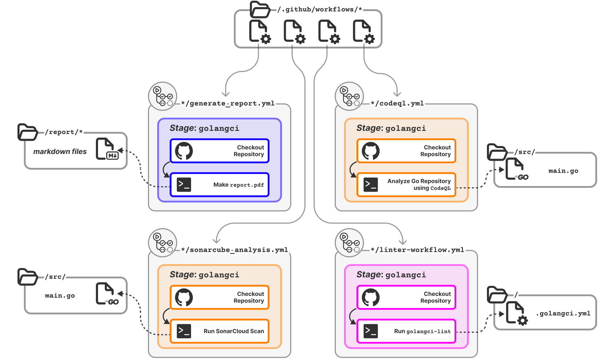

# Process Perspective

## CI/CD (GitHub Actions)

[GitHub Actions](https://github.com/features/actions) was chosen based on its simplicity, familiarity, and free pricing [@githubactions_vs_jenkins], [@20_cicd_comparison]. 
A motivating factor, was the suite of services supported natively in Github, of these a few were utilized:

* [GitHub  Action Secrets & Variables](https://github.com/DuwuOps/minitwit/settings/secrets/actions) for storing ssh-keys, passwords, etc.
* [GitHub Tags, Releases & Artifacts Storage](https://github.com/DuwuOps/minitwit/releases) for artifact versioning of the GoLang application.
* [GitHub Applications](https://github.com/DuwuOps/minitwit/settings/installations) for code quality evaluations with [CodeClimate](https://codeclimate.com/), [SonarQubeCloud](https://docs.sonarsource.com/sonarqube-cloud/), and [qtlysh](https://github.com/qltysh).
* [GitHub Projects, Tasks & Backlog](https://github.com/orgs/DuwuOps/projects/1) for managing task formulation and distribution.

### CI/CD Pipelines
A total of **7** pipelines are established, these are: 

| File    | Purpose | Invoked on |
| ---- | ------ | --- |
| `continous-development.yml`  | Primary CI/CD flow against PROD | Pushing `main` |
| `codeql.yml` | Analyzes go source code using [`CodeQL`](https://codeql.github.com/) | Push & PRs to `main`. | 
| `generate-report.yml`| Generates `report.pdf` from files in `/report/*` | Push to `/report/*` | 
| `linter-workflow.yml`| Runs [golangci-lint](https://github.com/golangci/golangci-lint) on go source code. | Push `main` or any PR | 
| `pull-request-tests.yml` | Runs python tests. | All PRs |
| `test-deployment.yml`    | Secondary CI/CD flow against TEST. | Tag `test-env*` | 
| `sonarcube_analysis.yml` | Analyses go source code using SonarCloud. | PRs to `main` |

Table:  List of GitHub Actions workflows employed.
<!-- This is how you write table captions!!!! -->

### CI/CD Specific Technologies
* The [`golangci-lint`](https://github.com/golangci/golangci-lint) linter is implemented in [`linter-workflow.yml`](https://github.com/DuwuOps/minitwit/blob/ff2bcaca1b56694ef6ac8f08f58988c04c87ad2a/.github/workflows/linter-workflow.yml) (see tasks [#119](https://github.com/DuwuOps/minitwit/issues/119) and [#129](https://github.com/DuwuOps/minitwit/issues/129))
* The [`pandoc`](https://pandoc.org/) library is used to generate laTeX reports from markdown in [`generate_report.yml
`](https://github.com/DuwuOps/minitwit/blob/ff2bcaca1b56694ef6ac8f08f58988c04c87ad2a/.github/workflows/generate_report.yml)
* The [`CodeQL`](https://codeql.github.com/) code analysis engine is used in [`codeql.yml`](https://github.com/DuwuOps/minitwit/blob/ff2bcaca1b56694ef6ac8f08f58988c04c87ad2a/.github/workflows/codeql.yml) to check for security vulnerabilities.
* Original `pytest` files are used in [`continous-development.yml`](https://github.com/DuwuOps/minitwit/blob/ff2bcaca1b56694ef6ac8f08f58988c04c87ad2a/.github/workflows/continous-development.yml)–now functioning as a `Test` stage (see [`minitwit_tests.py`](https://github.com/DuwuOps/minitwit/blob/ff2bcaca1b56694ef6ac8f08f58988c04c87ad2a/refactored_minitwit_tests.py) and [`sim_api_test.py`](https://github.com/DuwuOps/minitwit/blob/ff2bcaca1b56694ef6ac8f08f58988c04c87ad2a/sim_api_test.py)).

### Choice of CI/CD

* Since GitHub was chosen, [GitLab CI/CD](https://docs.gitlab.com/ci/) and [BitBucket Pipelines](https://www.atlassian.com/software/bitbucket/features/pipelines) were discarded, as they are specific to alternative git repository management sites.
* Commercial automation tools such as [Azure DevOps](https://azure.microsoft.com/en-us/products/devops) and [TeamCity](https://www.jetbrains.com/teamcity/) were discarded due to the pricing and limitations of their free plans.

As such, the choice was between GitHub's native [GitHub Actions](https://github.com/features/actions) or a CI/CD system agnostic to repository management sites. 

It was decided that time-to-production, in the case of establishing working CI/CD pipelines, was the biggest priority. As an alternative, the self-hosted automation system [Jenkins](https://www.jenkins.io/) was considered, but the perceived learning curve along with the self-hosted infrastructure setup [@20_cicd_comparison] dissuaded it as the choice of CI/CD system.

| **CI/CD Tool / Platform** | **GitHub Actions** | **Jenkins** | **Azure DevOps** | **TeamCity (JetBrains)** |
|--------|--------|--------|--------|--------|
| **Ease-of-use** | Simple [@githubactions_vs_jenkins] | Medium [@githubactions_vs_jenkins] | *Undetermined* | *Undetermined* |
| **Version Control** | Native GitHub Integration [@20_cicd_comparison] | Agnostic [@20_cicd_comparison] | Agnostic [@20_cicd_comparison] | Agnostic [@20_cicd_comparison] |
| **Hosting** | Primarily cloud-based [@20_cicd_comparison] | Self-hosted [@20_cicd_comparison] | Cloud-based [@20_cicd_comparison] | Cloud-based or self-hosted [@20_cicd_comparison] |
| **Pricing Model** | Free for public repositories, tiered for private [@20_cicd_comparison] | Open-source (MIT License), only cost is for hosting [@20_cicd_comparison] | Commercial with a limited free tier [@20_cicd_comparison] | Commercial [@20_cicd_comparison] |
Table: Comparison between CI/CD systems.

## Monitoring 
<!-- Monitoring choice arguments is not a requirement (I checked), but added anyway since we had it.  -->
- We use Prometheus as an Echo middleware, with additional custom made metrics to scrape our application every 5 seconds.
    - Custom metrics: 
        - User follower (gauge)
        - User followees (gauge)
        - VM CPU usage (gauge)
        - Messages posted (by time) (counter)
        - Messages posted (by user) (gauge)
        - Mesages flagged (by user) (gauge)
        - New user (counter)
        - Total users (gauge)
    <!-- Der er det her i vores kode som jeg ikke helt ved hvad er og om det burde komme med her:
    MemoryUsage.WithLabelValues("UsedPercent").Set(vm.UsedPercent)
                MemoryUsage.WithLabelValues("Used").Set(float64(vm.Used))
                MemoryUsage.WithLabelValues("Available").Set(float64(vm.Available))
                MemoryUsage.WithLabelValues("Total").Set(float64(vm.Total))
    -->
    - Prometheus was chosen on the background of:
        - Demonstrated in Class
        - Easy integration with golang/echo via. middleware
        - Wide spread usage and easy to integrate with e.g. Grafana
        - Free to use
- Grafana
    - As of writing this, the dashboards does not work due to swarm scaling. All pictures are from the day of the simulator stopping. 
    - Users:
        - Admin user with password shared with the group.
        - Helge and Mircea specific login as described on Teams.
    - Was chosen on the background of:
        - Demonstrated in Class
        - Rich Visualization 
        - Free to use 
        <!-- Har fjernet Alerting Functionality (fra overleaf listen) fordi vi alerter gennem botten og ikke gennem grafana -->

### Grafana Dashboards

**Whitebox Request and response monitoring dashboard:**

Timeframe: last 30 minutes:

Timeframe: Last 2 days:

**Whitebox User action dashboards monitoring:**

Timeframe: Last 7 days:

**Whitebox Virtual memory dashboard monitoring:**

Timframe: last 5 minutes:

### Black box monitoring

Black box user side error monitoring was given by the Helge and Mircea in form of the Status and Simulator API errors graf. We were encouraged to just use this as our client side error monitoring. <!-- Helge said this in a lecture  -->

### DigitalOcean monitoring

DigitalOcean provides some monitoring capabilities (Bandwidth, CPU usage, and Disk I/O). This did help to identify an attack. More on that [Insert refrence here]

### Alert System
An alert system was set up via a Discord bot that on the server via a cronjob that checks every 5 miniutes. If the application is not up it sends a Discord message and tags everyone on our group server. 

 <!-- Jeg syntes det var sødt med et billede af vores discord, hvis nogen er uenige så bare fjern <3> -->
 <!-- So cute! luv it -->

## Logging
- The ELK method was implemented but ultimatly scraped in favor of using loki/alloy that intergrate with Grafana which gather our logging and monitoring the same place. 
- Practical Principles:
    - TODO: A process should not worry about storage
    - TODO: A process should log only what is necessary
    - TODO: Logging should be done at the proper level: Mention emoji use
    - Logs should be centralised: All logs can be found via Grafana->Drilldown->Logs

## Strategy for scaling and upgrades
- We used docker swarm with docker stack so that we could leverage the docker compose configurations that were already in use. However, some changes has to be made to accommodate the docker stack specifications and issues related to splitting the services unto different droplets. The changes were: 
    - an overlay network
    - defining how many replicas should be deployed per service
    - defining on which droplet the monitoring services should be running
    - other configurations across technologies
- Docker has been configured to do rolling updates as this is nativly supported on docker swarm, through various update-configurations for relevant services.
- Docker has been configured to rollback if a minitwit-container crashes whithin 30 seconds of deployment.

## AI use
Throughout the development process, all team members leveraged artificial intelligence tools to varying degrees and for diverse applications. The primary AI systems employed included ChatGPT, Claude, DeepSeek, and GitHub Copilot. Team members provided contextual information regarding code issues or implementation challenges, utilizing AI-generated responses as foundational guidance for problem-solving methodologies rather than direct solution implementation. This methodology facilitated the identification of potential problem domains and remediation strategies while preserving critical assessment of AI-derived recommendations. In accordance with transparency requirements, AI tools have been formally acknowledged as co-authors in relevant version control commits where their contributions influenced the development process.  (This paragraf was written using AI lol)
<!-- Det her er bare mig der syntes det er thihi fnis as få AI til at skrive AI afsnittet. Hvis nogle er uenige så bare lav det om <3 > -->