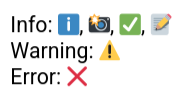

# Process Perspective

## CI/CD

[GitHub Actions](https://github.com/features/actions) was chosen based on its simplicity, familiarity, and free pricing [@githubactions_vs_jenkins], [@20_cicd_comparison]. 
A motivating factor was the suite of services supported natively in Github, where a few of which were utilized:

* [GitHub  Action Secrets & Variables](https://github.com/DuwuOps/minitwit/settings/secrets/actions) for storing ssh-keys, passwords, etc.
* [GitHub Tags, Releases & Artifacts Storage](https://github.com/DuwuOps/minitwit/releases) for artifact versioning of the GoLang application.
* [GitHub Applications](https://github.com/DuwuOps/minitwit/settings/installations) for code quality evaluations with [CodeClimate](https://codeclimate.com/) and [SonarQubeCloud](https://docs.sonarsource.com/sonarqube-cloud/).
* [GitHub Projects, Tasks & Backlog](https://github.com/orgs/DuwuOps/projects/1) for managing task formulation and distribution.

### CI/CD Pipelines
A total of **7** pipelines are established, these are: 

| File    | Purpose | Invoked on |
| ---- | ------ | --- |
| `continous-development.yml`  | Primary CI/CD flow against PROD | Pushing `main` |
| `codeql.yml` | Analyzes go source code using [`CodeQL`](https://codeql.github.com/) | Push & PRs to `main`. | 
| `generate-report.yml`| Generates `report.pdf` from files in `/report/*` | Push to `/report/*` | 
| `linter-workflow.yml`| Runs [golangci-lint](https://github.com/golangci/golangci-lint) on go source code. | Push `main` or any PR | 
| `pull-request-tests.yml` | Runs python tests. | All PRs |
| `test-deployment.yml`    | Secondary CI/CD flow against TEST. | Tag `test-env*` | 
| `sonarcube_analysis.yml` | Analyses go source code using SonarCloud. | PRs to `main` |

Table:  List of GitHub Actions workflows employed.
<!-- This is how you write table captions!!!! -->

### CI/CD Specific Technologies
* The [`golangci-lint`](https://github.com/golangci/golangci-lint) linter is implemented in [`linter-workflow.yml`](https://github.com/DuwuOps/minitwit/blob/ff2bcaca1b56694ef6ac8f08f58988c04c87ad2a/.github/workflows/linter-workflow.yml) (see tasks [#119](https://github.com/DuwuOps/minitwit/issues/119) and [#129](https://github.com/DuwuOps/minitwit/issues/129))
* The [`pandoc`](https://pandoc.org/) library is used to generate laTeX reports from markdown in [`generate_report.yml
`](https://github.com/DuwuOps/minitwit/blob/ff2bcaca1b56694ef6ac8f08f58988c04c87ad2a/.github/workflows/generate_report.yml)
* The [`CodeQL`](https://codeql.github.com/) code analysis engine is used in [`codeql.yml`](https://github.com/DuwuOps/minitwit/blob/ff2bcaca1b56694ef6ac8f08f58988c04c87ad2a/.github/workflows/codeql.yml) to check for security vulnerabilities.
* Original `pytest` files are used in [`continous-development.yml`](https://github.com/DuwuOps/minitwit/blob/ff2bcaca1b56694ef6ac8f08f58988c04c87ad2a/.github/workflows/continous-development.yml)–now functioning as a `Test` stage (see [`minitwit_tests.py`](https://github.com/DuwuOps/minitwit/blob/ff2bcaca1b56694ef6ac8f08f58988c04c87ad2a/refactored_minitwit_tests.py) and [`sim_api_test.py`](https://github.com/DuwuOps/minitwit/blob/ff2bcaca1b56694ef6ac8f08f58988c04c87ad2a/sim_api_test.py)).

{#fig:github_actions-continuous-development width=80% placement=H}

{#fig:github_actions-other width=80% placement=H}

### Choice of CI/CD

* Since GitHub was chosen, [GitLab CI/CD](https://docs.gitlab.com/ci/) and [BitBucket Pipelines](https://www.atlassian.com/software/bitbucket/features/pipelines) were discarded, as they are specific to alternative git repository management sites.
* Commercial automation tools such as [Azure DevOps](https://azure.microsoft.com/en-us/products/devops) and [TeamCity](https://www.jetbrains.com/teamcity/) were discarded due to the pricing.

As such, the choice was between GitHub's native [GitHub Actions](https://github.com/features/actions) or a CI/CD system agnostic to repository management sites. 

It was decided that time-to-production, in the case of establishing working CI/CD pipelines, was the biggest priority. As an alternative, the self-hosted automation system [Jenkins](https://www.jenkins.io/) was considered, but the perceived learning curve along with the self-hosted infrastructure setup [@20_cicd_comparison] dissuaded us from this choice.

| **CI/CD Tool / Platform** | **GitHub Actions** | **Jenkins** | **Azure DevOps** | **TeamCity (JetBrains)** |
|--------|--------|--------|--------|--------|
| **Ease-of-use** | Simple [@githubactions_vs_jenkins] | Medium [@githubactions_vs_jenkins] | *Undetermined* | *Undetermined* |
| **Version Control** | Native GitHub Integration [@20_cicd_comparison] | Agnostic [@20_cicd_comparison] | Agnostic [@20_cicd_comparison] | Agnostic [@20_cicd_comparison] |
| **Hosting** | Primarily cloud-based [@20_cicd_comparison] | Self-hosted [@20_cicd_comparison] | Cloud-based [@20_cicd_comparison] | Cloud-based or self-hosted [@20_cicd_comparison] |
| **Pricing Model** | Free for public repositories, tiered for private [@20_cicd_comparison] | Open-source (MIT License), only cost is for hosting [@20_cicd_comparison] | Commercial with a limited free tier [@20_cicd_comparison] | Commercial [@20_cicd_comparison] |

Table: Comparison between CI/CD systems.

## Monitoring 
<!-- Monitoring choice arguments is not a requirement (I checked), but added anyway since we had it.  -->
### Prometheus
Prometheus is used as an Echo middleware, with custom-made metrics to scrape our application every 5 seconds. Prometheus was chosen since the familiarity from class, easy integration with golang, popularity, easy integration with Grafana and free price.

The custom metrics are: User follower (gauge), user followees (gauge), VM CPU usage (gauge), messages posted (by time) (counter), messages posted (by user) (gauge), mesages flagged (by user) (gauge), new user (counter), total users (gauge)

<!-- Der er det her i vores kode som jeg ikke helt ved hvad er og om det burde komme med her:
MemoryUsage.WithLabelValues("UsedPercent").Set(vm.UsedPercent)
            MemoryUsage.WithLabelValues("Used").Set(float64(vm.Used))
            MemoryUsage.WithLabelValues("Available").Set(float64(vm.Available))
            MemoryUsage.WithLabelValues("Total").Set(float64(vm.Total))
-->

### Grafana
Grafana was chosen because of the familiarity from class, rich visualisation and free price. In Grafana two users are configured: Admin user and the specific login for Helge and Mircea.
After introducing swarm scaling the dashboards are non-functional. Therefore, the pictures presented is from the day of the simulator stopping.

<!-- Har fjernet Alerting Functionality (fra overleaf listen) fordi vi alerter gennem botten og ikke gennem grafana -->

### Grafana Dashboards

**Whitebox Request and Response Monitoring Dashboard:**

Timeframe: last 30 minutes:

{#fig:monitoring-response-request-t30 width=80% placement=H}

Timeframe: Last 2 days:

{#fig:monitoring-response-request-t2d width=80% placement=H}

**Whitebox User Action Dashboards Monitoring:**

Timeframe: Last 7 days:

{#fig:monitoring-user-actions-t7d width=80% placement=H}

**Whitebox Virtual Memory Dashboard Monitoring:**

Timframe: last 5 minutes:

{#fig:monitoring-VM-usage-t5 width=80% placement=H}

### Other types of monitoring

- **Black Box Monitoring:** By the Status and Simulator API errors graf from class

- **DigitalOcean Monitoring:** DigitalOcean provides some monitoring capabilities (Bandwidth, CPU usage, and Disk I/O).

- **Alert System:** An alert system was set up via a Discord bot that checks the application on the server every 5 minutes. If the application is not up, it sends a Discord message and tags everyone on our group server.

{#fig:alert-example width=80% placement=H}

 <!-- Jeg syntes det var sødt med et billede af vores discord, hvis nogen er uenige så bare fjern <3> -->
 <!-- So cute! luv it -->

## Logging
<!--Jeg har ikke genbesøgt Loki og Alloy config filerne siden jeg satte det op. 
Her er status (desværre):
1) 
    Vi har aldrig customized de filtre man kan sætte i Alloy, så alting sendes (næsten) direkte videre til Loki i stedet for at filtreres (hvilket ikke er mandatory men noget man kan og bør)
2) 
    Loki storage er en lokal fil "/tmp/loki/" frem for det de anbefalede i forelæsningen som var en stream

Jeg tænker det ville være helt godnat at opdatere config filerene nu, men vi må lige formulere os så vi er ærlige
-->

Grafana Alloy, Grafana Loki and Grafana were chosen to handle the collection, aggregation, and presentation of logs, respectively.

To ensure application log messages are usable, logs are created at different levels of severity. To further ensure they are readable at a glance, emojis are used:

{#fig:logging-emojis width=40% placement=H}

Alloy collects logs by gathering data from containers on the same docker environment. The gathered logs are sent to Loki for aggregation and eventual display. One instance of Alloy exists on each worker node. 

To ensure that logs are centralised, Loki only runs on the manager node, but collects data from all Alloy instances. The collected logs can be found via. Grafana->Drilldown->Logs. 

{#fig:logging-dashboard-post-swarm width=80% placement=H}

Loki is currently configured to store logs in a folder called `tmp`. While this approach provides reliable log persistence, transitioning to an unbuffered stdout stream would be better to align with the principle that processes should not manage their own storage. 

<!-- Practical Principles:
    - Oh no: A process should not worry about storage
    - Oh no: A process should log only what is necessary
    - Yes: Logging should be done at the proper level: Mention emoji use-->

## Strategy for Scaling and Upgrades
We used Docker Swarm with Docker Stack to reuse the already existing Docker compose configurations. 
However, some changes was necessary to accommodate the Docker Stack specifications and issues related to splitting the services onto different droplets. 

The changes included:

- Setting up an overlay network

- Specifying the number of replicas for each service

- Assigning monitoring services to specific droplets

- Adjusting configurations across various technologies

Docker has been configured to do rolling updates as this is nativly supported on docker swarm.
Additionally, Docker has been configured to rollback if a minitwit-container crashes whithin 30 seconds of deployment.

## AI Use
Throughout the development process, the team used the AIs ChatGPT, Claude, DeepSeek, and GitHub Copilot. 

These were used to:

- Understand and fix code issues
- Help format and phrase code and text
- Provide inspiration during development 

The team has found them expecially helpful for bug-fixing, but has been mindful to always set AIs as co-authors on relevant commits. 