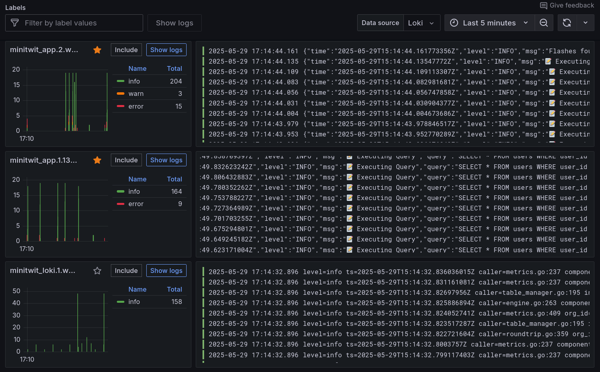

# Process Perspective

## CI/CD

[GitHub Actions](https://github.com/features/actions) was chosen based on its simplicity, familiarity, and free pricing [@githubactions_vs_jenkins], [@20_cicd_comparison]. 
A motivating factor was the suite of services supported natively in Github, of which the following were utilized:

* [GitHub  Action Secrets & Variables](https://github.com/DuwuOps/minitwit/settings/secrets/actions) for storing ssh-keys, passwords, etc.
* [GitHub Tags, Releases & Artifacts Storage](https://github.com/DuwuOps/minitwit/releases) for artifact versioning of the application.
* [GitHub Applications](https://github.com/DuwuOps/minitwit/settings/installations) for code quality evaluations with [CodeClimate](https://codeclimate.com/) and [SonarQubeCloud](https://docs.sonarsource.com/sonarqube-cloud/).
* [GitHub Projects, Tasks & Backlog](https://github.com/orgs/DuwuOps/projects/1) for defining and distributing tasks.

### CI/CD Pipelines
In total, **7** pipelines are established (see @tbl:pipelines).

+---------------------------+------------------------------------------------------------+---------------------------+
| **File**                  | **Purpose**                                                | **Invoked On**            |
+===========================+============================================================+===========================+
| `continous-development.yml` | Primary CI/CD flow against PROD                         | Pushing `main`            |
+---------------------------+------------------------------------------------------------+---------------------------+
| `codeql.yml`              | Analyzes go source code using                             | Push & PRs to `main`      |
|                           | [`CodeQL`](https://codeql.github.com/)                    |                           |
+---------------------------+------------------------------------------------------------+---------------------------+
| `generate-report.yml`     | Generates `report.pdf` from files in `/report/*`          | Push to `/report/*`       |
+---------------------------+------------------------------------------------------------+---------------------------+
| `linter-workflow.yml`     | Runs [golangci-lint](https://github.com/golangci/golangci-lint) | Push `main` or any PR   |
|                           | on go source code                                          |                           |
+---------------------------+------------------------------------------------------------+---------------------------+
| `pull-request-tests.yml`  | Runs python tests                                          | All PRs                   |
+---------------------------+------------------------------------------------------------+---------------------------+
| `test-deployment.yml`     | Secondary CI/CD flow against TEST                         | Tag `test-env*`           |
+---------------------------+------------------------------------------------------------+---------------------------+
| `sonarcube_analysis.yml`  | Analyses go source code using SonarCloud                  | PRs to `main`             |
+---------------------------+------------------------------------------------------------+---------------------------+

Table: List of GitHub Actions workflows employed. {#tbl:pipelines}

### CI/CD Specific Technologies
* The [`golangci-lint`](https://github.com/golangci/golangci-lint) linter is implemented in [`linter-workflow.yml`](https://github.com/DuwuOps/minitwit/blob/ff2bcaca1b56694ef6ac8f08f58988c04c87ad2a/.github/workflows/linter-workflow.yml) (see tasks [#119](https://github.com/DuwuOps/minitwit/issues/119) and [#129](https://github.com/DuwuOps/minitwit/issues/129))
* The [`pandoc`](https://pandoc.org/) library is used to generate laTeX reports from markdown in [`generate_report.yml
`](https://github.com/DuwuOps/minitwit/blob/ff2bcaca1b56694ef6ac8f08f58988c04c87ad2a/.github/workflows/generate_report.yml)
* The [`CodeQL`](https://codeql.github.com/) code analysis engine is used in [`codeql.yml`](https://github.com/DuwuOps/minitwit/blob/ff2bcaca1b56694ef6ac8f08f58988c04c87ad2a/.github/workflows/codeql.yml) to check for security vulnerabilities.
* Original `pytest` files are used in [`continous-development.yml`](https://github.com/DuwuOps/minitwit/blob/ff2bcaca1b56694ef6ac8f08f58988c04c87ad2a/.github/workflows/continous-development.yml)–now functioning as a `Test` stage (see [`minitwit_tests.py`](https://github.com/DuwuOps/minitwit/blob/ff2bcaca1b56694ef6ac8f08f58988c04c87ad2a/refactored_minitwit_tests.py) and [`sim_api_test.py`](https://github.com/DuwuOps/minitwit/blob/ff2bcaca1b56694ef6ac8f08f58988c04c87ad2a/sim_api_test.py)).

{#fig:github_actions-continuous-development width=80% placement=H}

{#fig:github_actions-other width=80% placement=H}

### Choice of CI/CD
A comparison of CI/CD systems was performed, and the results can be seen in @tbl:cicd-comparison.

* Since GitHub was chosen, [GitLab CI/CD](https://docs.gitlab.com/ci/) and [BitBucket Pipelines](https://www.atlassian.com/software/bitbucket/features/pipelines) were discarded, as they are specific to alternative git repository management sites.
* Commercial automation tools such as [Azure DevOps](https://azure.microsoft.com/en-us/products/devops) and [TeamCity](https://www.jetbrains.com/teamcity/) were discarded due to pricing.

As such, the choice was between GitHub's [GitHub Actions](https://github.com/features/actions) or a CI/CD system agnostic to repository management sites. 

The self-hosted automation system [Jenkins](https://www.jenkins.io/) was considered, but the perceived learning curve along with the self-hosted infrastructure setup [@20_cicd_comparison] dissuaded us from this choice, as time-to-production for *establishing* CI/CD pipelines was an important factor for us.

+-----------------------------+---------------------+---------------------+---------------------+---------------------------+
| **Feature**                 | **GitHub Actions** | **Jenkins**         | **Azure DevOps**   | **TeamCity**              |
|                             |                     |                     |                     | **(JetBrains)**           |
+=============================+=====================+=====================+=====================+===========================+
| **Ease-of-use**             | Simple              | Medium              | *Undetermined*      | *Undetermined*            |
|                             | [@githubactions_vs_jenkins] | [@githubactions_vs_jenkins] |           |                           |
+-----------------------------+---------------------+---------------------+---------------------+---------------------------+
| **Version Control**         | Native GitHub       | Agnostic            | Agnostic            | Agnostic                  |
|                             | Integration         | [@20_cicd_comparison] | [@20_cicd_comparison] | [@20_cicd_comparison]   |
|                             | [@20_cicd_comparison] |                   |                     |                           |
+-----------------------------+---------------------+---------------------+---------------------+---------------------------+
| **Hosting**                 | Primarily           | Self-hosted         | Cloud-based         | Cloud-based or            |
|                             | cloud-based         | [@20_cicd_comparison] | [@20_cicd_comparison] | self-hosted             |
|                             | [@20_cicd_comparison] |                   |                     | [@20_cicd_comparison]     |
+-----------------------------+---------------------+---------------------+---------------------+---------------------------+
| **Pricing Model**           | Free for public     | Open-source         | Commercial with     | Commercial                |
|                             | repositories,       | (MIT License),      | limited free tier   | [@20_cicd_comparison]     |
|                             | tiered for private  | only cost is        | [@20_cicd_comparison] |                         |
|                             | [@20_cicd_comparison] | hosting           |                     |                           |
|                             |                     | [@20_cicd_comparison] |                   |                           |
+-----------------------------+---------------------+---------------------+---------------------+---------------------------+

Table: Comparison between CI/CD systems. {#tbl:cicd-comparison}

## Monitoring 

### Prometheus
[Prometheus](https://prometheus.io/) is used to collect and store metrics, and is invoked as a middleware service of [Echo](https://echo.labstack.com/) in the MiniTwit GoLang application. [Prometheus](https://prometheus.io/) was chosen due to its familiarity from class, native integration with Echo [@echo_prometheus_middleware], inferred popularity, integration with Grafana, and open-source license [@prometheus].

In our implementation, [Prometheus](https://prometheus.io/) scrapes application every 5 seconds (see [`prometheus.yml`](https://github.com/DuwuOps/minitwit/blob/6faf790cde505828b23b891698cd11fe85e31ad0/.infrastructure/prometheus/prometheus.yml)). Custom-made metrics are implemented in [Echo](https://echo.labstack.com/) to expose specific information from the GoLang implementation (see [`src/metrics/`](https://github.com/DuwuOps/minitwit/tree/6faf790cde505828b23b891698cd11fe85e31ad0/src/metrics)), these are outlined in @tbl:prometheus-metrics

+--------------------------------+-------------+---------------------------------------------------------------------+
| **Operation**                  | **Type**    | **Purpose**                                                         |
+================================+=============+=====================================================================+
| User follower                  | Gauge       | Tracks the current number of followers a user has                   |
+--------------------------------+-------------+---------------------------------------------------------------------+
| User followees                 | Gauge       | Tracks the current number of users a specific user is following     |
+--------------------------------+-------------+---------------------------------------------------------------------+
| VM CPU usage                   | Gauge       | Monitors real-time CPU usage on a virtual machine                   |
+--------------------------------+-------------+---------------------------------------------------------------------+
| Messages posted (by time)      | Counter     | Counts the total number of messages posted over time                |
+--------------------------------+-------------+---------------------------------------------------------------------+
| Messages posted (by user)      | Gauge       | Tracks the current message count for individual users               |
+--------------------------------+-------------+---------------------------------------------------------------------+
| Messages flagged (by user)     | Gauge       | Tracks how many messages a user has flagged                         |
+--------------------------------+-------------+---------------------------------------------------------------------+
| New user                       | Counter     | Counts the number of new users registered over time                 |
+--------------------------------+-------------+---------------------------------------------------------------------+
| Total users                    | Gauge       | Tracks the current total number of users in the system              |
+--------------------------------+-------------+---------------------------------------------------------------------+

Table: Custom-made metrics for [Prometheus](https://prometheus.io/). **Note:** See [`src/metrics/`](https://github.com/DuwuOps/minitwit/tree/6faf790cde505828b23b891698cd11fe85e31ad0/src/metrics) for implementation. {#tbl:prometheus-metrics}

<!-- Der er det her i vores kode som jeg ikke helt ved hvad er og om det burde komme med her:
MemoryUsage.WithLabelValues("UsedPercent").Set(vm.UsedPercent)
            MemoryUsage.WithLabelValues("Used").Set(float64(vm.Used))
            MemoryUsage.WithLabelValues("Available").Set(float64(vm.Available))
            MemoryUsage.WithLabelValues("Total").Set(float64(vm.Total)) -->

### Grafana
[Grafana](https://grafana.com/) was chosen because of the familiarity from class, rich visualisation and open-source license. In Grafana two users are configured: Admin user and a specific login for Helge and Mircea.
As per the introduction of [Docker Swarm](https://docs.docker.com/engine/swarm/), the dashboards created unfortunately became non-functional. As such, pictures are presented showing how the dashboards functioned prior to the simular stopping.

<!-- Har fjernet Alerting Functionality (fra overleaf listen) fordi vi alerter gennem botten og ikke gennem grafana -->

### Grafana Dashboards

**Whitebox Request and Response Monitoring Dashboard:**

Timeframe: last 30 minutes:

{#fig:monitoring-response-request-t30 width=80% placement=h}

Timeframe: Last 2 days:

{#fig:monitoring-response-request-t2d width=80% placement=h}

**Whitebox User Action Dashboards Monitoring:**

Timeframe: Last 7 days:

{#fig:monitoring-user-actions-t7d width=80% placement=h}

**Whitebox Virtual Memory Dashboard Monitoring:**

Timframe: last 5 minutes:

{#fig:monitoring-VM-usage-t5 width=80% placement=h}

### Other types of monitoring

- **Black Box Monitoring:** By the Status and Simulator API errors graf from class

- **DigitalOcean Monitoring:** DigitalOcean provides some monitoring capabilities (Bandwidth, CPU usage, and Disk I/O).

- **Alert System:** An alert system was set up via a Discord bot that checks the application on the server every 5 minutes. If the application is not up, it sends a Discord message and tags everyone on our group server.

{#fig:alert-example width=80% placement=h}

 <!-- Jeg syntes det var sødt med et billede af vores discord, hvis nogen er uenige så bare fjern <3> -->
 <!-- So cute! luv it -->

## Logging
<!--Jeg har ikke genbesøgt Loki og Alloy config filerne siden jeg satte det op. 
Her er status (desværre):
1) 
    Vi har aldrig customized de filtre man kan sætte i Alloy, så alting sendes (næsten) direkte videre til Loki i stedet for at filtreres (hvilket ikke er mandatory men noget man kan og bør)
2) 
    Loki storage er en lokal fil "/tmp/loki/" frem for det de anbefalede i forelæsningen som var en stream

Jeg tænker det ville være helt godnat at opdatere config filerene nu, men vi må lige formulere os så vi er ærlige
-->

Grafana Alloy, Grafana Loki and Grafana were chosen to handle the collection, aggregation, and presentation of logs, respectively.

To ensure application log messages are usable, logs are created at different levels of severity. To further ensure they are readable at a glance, emojis are used:

{#fig:logging-emojis width=30% placement=H}

Alloy collects logs by gathering data from containers on the same docker environment. The gathered logs are sent to Loki for aggregation and eventual display. One instance of Alloy exists on each worker node. 

To ensure that logs are centralised, Loki only runs on the manager node, but collects data from all Alloy instances. The collected logs can be found via. Grafana->Drilldown->Logs. 

{#fig:logging-dashboard-post-swarm width=80% placement=H}

Loki is configured to store logs in a folder called `tmp`. While this approach provides reliable log persistence, transitioning to an unbuffered stdout stream would be better to align with the principle that processes should not manage their own storage. 

<!-- Practical Principles:
    - Oh no: A process should not worry about storage
    - Oh no: A process should log only what is necessary
    - Yes: Logging should be done at the proper level: Mention emoji use-->

## Strategy for Scaling and Upgrades
We used Docker Swarm with Docker Stack to reuse the already existing Docker compose configurations. 
However, some changes was necessary to accommodate the Docker Stack specifications and issues related to splitting the services onto different droplets. 

The changes included:

- Setting up an overlay network

- Specifying the number of replicas for each service

- Assigning monitoring services to specific droplets

- Adjusting configurations across various technologies

Docker has been configured to do rolling updates as this is nativly supported on Docker Swarm.
Additionally, Docker has been configured to rollback if a minitwit-container crashes whithin 30 seconds of deployment.

## AI Use
Throughout the development process, the team used the AIs ChatGPT, Claude, DeepSeek, and GitHub Copilot. 

These were used to:

- Understand and fix code issues
- Help format and phrase code and text
- Provide inspiration during development 

The team has found them expecially helpful for bug-fixing, but has been mindful to always set AIs as co-authors on relevant commits.