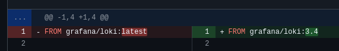

# Reflections

<!--Major learnings related to these 3 topics...-->

## Evolution and refactoring
- ELK: The ELK method was implemented but ultimately scrapped in favor of using Loki and Alloy. These integrate with Grafana, which let us gather our logging and monitoring the same place.

- Using repository pattern (almost)

- Database migration

- Helpers VS utils - are they the same?

## Operations
- We were attacked

## Maintenance

### Logging
- Tags: We experienced *a lot* of errors in the Loki logs initially due to an error that was introduced [in the Loki repository](https://github.com/grafana/loki/issues/17371#issuecomment-2842588408) and newest Dockerhub image shortly before we deployed logging to production (after testing in a test environment without errors). The fix was to use a specific version instead of `latest` ([see PR](https://github.com/DuwuOps/minitwit/pull/139)), but it took some research to get there.

{#fig:loki_version_fix width=80% placement=H}

