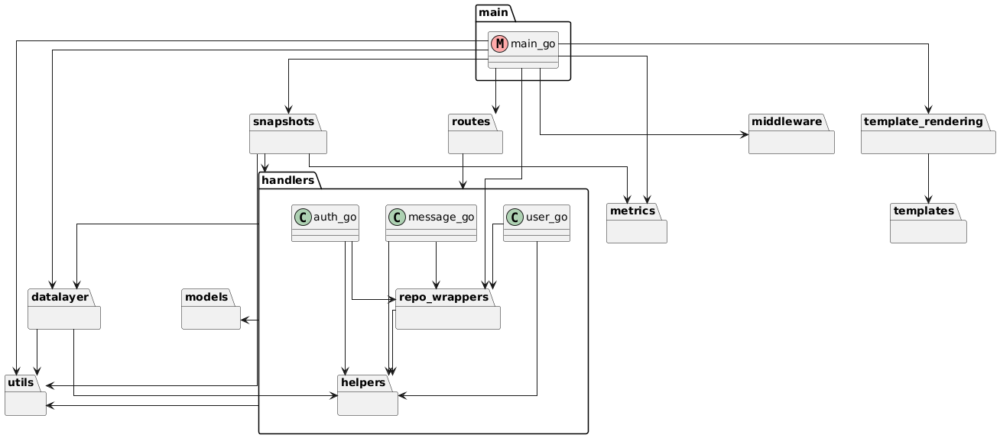
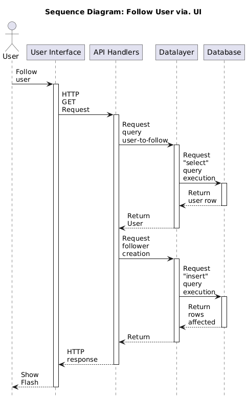
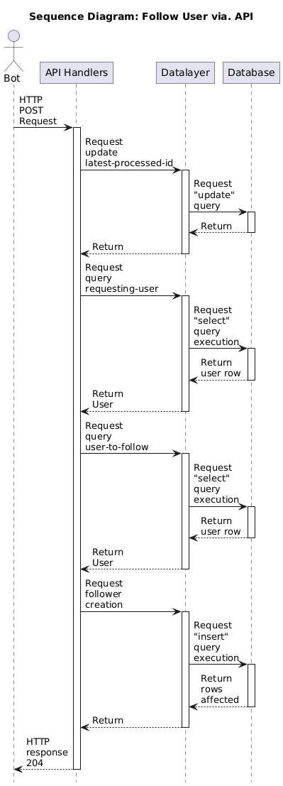
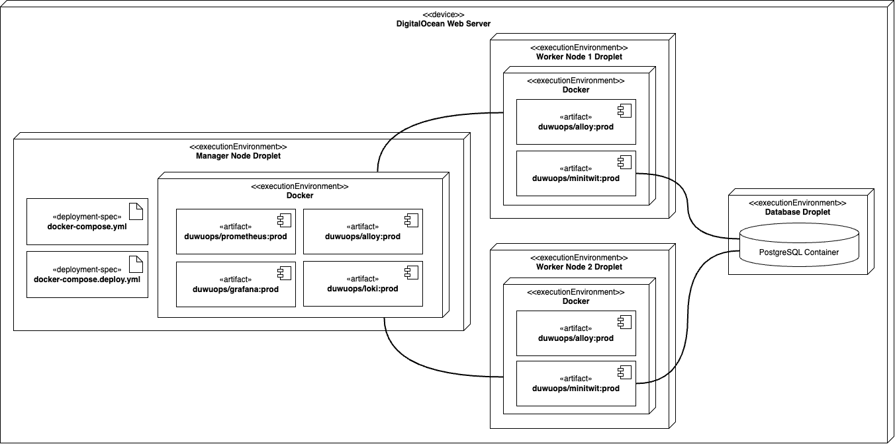

# System perspective

This section presents the system.

## Design and architecture 
The system is primarily built using Go (Golang) for backend development. The Echo web framework is used for HTTP routing and middleware management. PostgreSQL serves as the database. Additionally, the system uses various Go libraries for security, session management, data serialization, monitoring, system metrics and external systems that will be presented later. 

This section presents the architecture of the system by exploring the `src` folder of the repository.

### Module diagram

An overview of the modules of the codebase in the `src` folder is presented by the following package diagram.    
Note that within the `handlers` folder, the classes `auth.go`, `message.go`, and `user.go` and their dependencies are highlighted, depicting the complexity of this central module. This is thereby not a normal package diagram.

In the diagram, it can be seen that the `main.go` file orchestrates the system. It is responsible for:  
1. Rendering the templates (frontend)  
2. Initializing a new instance of the database object  
3. Setting up middleware  
4. Setting up routes, which expose endpoints that delegate logic to the `handlers` module for API processing.

#### Description of modules

| Module                     | Description                                                                                                                                                                                  |
|----------------------------|----------------------------------------------------------------------------------------------------------------------------------------------------------------------------------------------|
| **`datalayer`**            | Responsible for database connection and initialization. Implements the data access layer through `repository.go` and its interface `irepository.go`.                                         |
| **`models`**               | Contains core data models: `User`, `Message`, `Follower`, and `LatestAccessed` (used to track recent activity, e.g., new followers or messages).                                            |
| **`handlers`**             | Central logic of the system. Orchestrates operations for each model. Includes **`repo_wrappers`**: utility functions extending repository logic. Includes **`helpers`**: shared logic. |
| **`routes`**               | Maps HTTP endpoints to their corresponding handlers.                                                                                                                                           |
| **`metrics`**              | Registers Prometheus metrics to monitor system statistics.                                                                                                                                     |
| **`middleware`**           | Applies security measures such as CSRF token validation to incoming requests.                                                                                                                 |
| **`snapshots`**            | Handles creation of database snapshots for models.                                                                                                                                             |
| **`template_rendering`**   | Renders templates used by the frontend.                                                                                                                                                        |
| **`templates`**            | Holds frontend HTML files.                                                                                                                                                                     |
| **`utils`**                | Contains shared utility methods used across the codebase.                                                                                                                                      |

### Sequence diagrams
Below, two sequence diagrams showcase how the different parts of the system interact when procecssing a "Follow" request. The first version shows the processes involved when the request is sent via. the UI, whereas the second version shows the processes involved when sent via. the API. 

Note that while both versions use the same API, they use different endpoints.

## External dependencies

| Dependency                       | Description                                                                                         |
|---------------------------------|---------------------------------------------------------------------------------------------------|
| **Go (Golang)**                 | Main programming language for backend development.                                                |
| **github.com/labstack/echo/v4** | Web framework for routing and HTTP handling.                                                      |
| **github.com/gorilla/sessions** | Session management with secure cookie support.                                                   |
| **github.com/lib/pq**           | PostgreSQL driver for database connectivity.                                                     |
| **PostgreSQL**                  | Relational database storing application data.                                                    |
| **golang.org/x/crypto**         | Cryptographic utilities for security features.                                                   |
| **github.com/prometheus/client_golang** | Prometheus client for metrics and monitoring.                                              |
| **github.com/shirou/gopsutil/v4** | System metrics collection for health monitoring.                                                |
| **github.com/klauspost/compress** | Compression libraries to optimize data transfer.                                               |
| **golang.org/x/sys**             | Low-level OS interaction and system calls.                                                       |
| **google.golang.org/protobuf**   | Protocol Buffers support for data serialization.                                                |
| **github.com/gorilla/securecookie** | Secure cookie encoding/decoding for session safety.                                         |
| **Gravatar**                   | External web service providing avatar images generated from email hashes (used for user profiles). |

### Choices of Go and Echo 
This needs to be taken from the latex report.

## Current state of the system

### SonarQube analysis summary

The following table summarizes key code quality metrics from SonarQube analysis:

| Metric                 | Value                  |
|------------------------|------------------------|
| Lines of Code (LOC)    | 1,591                  |
| Code Duplication       | 4.1%                   |
| Security Hotspots      | 8                      |
| Overall Rating         | A (Excellent quality)  |
| Cyclomatic Complexity  | 216 (handlers: 151)    |
| Technical Debt         | ~1 hour 7 minutes      |

### Code Climate

The following table summarizes key code quality metrics from Code Climate analysis:

| Metric                 | Value                  |
|------------------------|------------------------|
| Lines of Code (LOC)    | 1,912                  |
| Code Duplication       | 0%                     |
| Overall Rating         | A (Excellent quality)  |
| Complexity             | 299 (handlers: 196)    |
| Technical Debt         | ~1 day 2 hours         |

### Overall assessment

Both tools show that the `handlers` module has relatively high complexity, which may require focused attention for maintainability.

## Deployment

### Allocation viewpoint

## Database (PostgreSQL)

Our setup includes two PostgreSQL databases: one for production and one for testing. Each runs on a separate, containerized droplet, with access restricted via a firewall to ensure security and isolation between environments (see Figure 1).

[PostgreSQL](https://www.postgresql.org/) was to replace the SQLite setup, due to strong SQL standards compliance [@do_dbcomparison], high community adoption [@stackoverflow_survey_2024], advanced features (e.g., JSON, HStore, Security) [@tooljet_mariavspostgres], [@Medium_Peymaan_DB_Comparison].

### Choice of Technology - Database

To replace our current SQLite setup, we compared leading relational databases based on the Stack Overflow 2024 Developer Survey [@stackoverflow_survey_2024]. Only open-source, self-hosted RDBMSs were considered—excluding NoSQL and cloud services.

| **Database** | **SQLite** | **PostgreSQL** | **MySQL** | **Oracle** | **SQL Server** | **MariaDB** |
| --- | --- | --- | --- | --- | --- | --- |
| **Popularity** | 33.1% [@stackoverflow_survey_2024] | 49.7% [@stackoverflow_survey_2024] | 40.3% [@stackoverflow_survey_2024] | 10.1% [@stackoverflow_survey_2024] | 25.3% [@stackoverflow_survey_2024] | 17.2% [@stackoverflow_survey_2024] |
| **License** | Public-Domain [@sqlite_license] | Open-Source [@postgresql_license] | Open-Source & Proprietary [@MySQL_license] | Proprietary | Proprietary [@microsoftsqlserver_license] | Open-Source [@mariadb_license] |
| **Standards Compliance** [@SQL_Standard_ISO] | Low [@do_dbcomparison] | Compliant [@do_dbcomparison] | Limited [@do_dbcomparison] | *Unknown* | *Unknown* | Fork of MySQL; Assumed limited |
| **Max Connections** | 1 | 500,000+ [@Medium_Peymaan_DB_Comparison] | 100,000+ [@Medium_Peymaan_DB_Comparison] | *Unknown* | *Unknown* | 200,000+ [@Medium_Peymaan_DB_Comparison] |
| **Horizontal Scaling** | No | Yes [@Medium_Peymaan_DB_Comparison] | Yes [@Medium_Peymaan_DB_Comparison] | *Unknown* | *Unknown* | Yes [@Medium_Peymaan_DB_Comparison] |
| **Concurrency Handling** | None | Excellent [@Medium_Peymaan_DB_Comparison] | Moderate [@Medium_Peymaan_DB_Comparison] | *Unknown* | *Unknown* | Strong [@Medium_Peymaan_DB_Comparison] |

Table: Comparison of RDBMSs.
**Note**: Performance benchmarks are excluded due to license restrictions placed on benchmarking by licensing of proprietary DBMSs [@Oracle_Network_License].
 
MySQL was ruled out due to licensing issues and development concerns post-Oracle acquisition [@Fedora_MariaDB], [@do_dbcomparison].