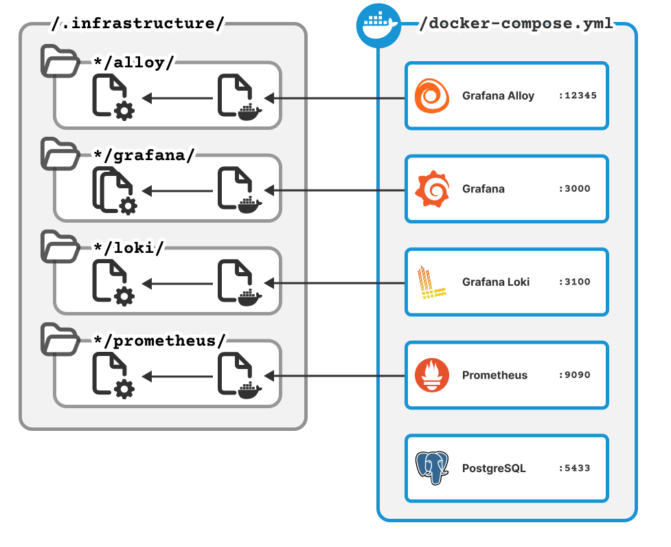
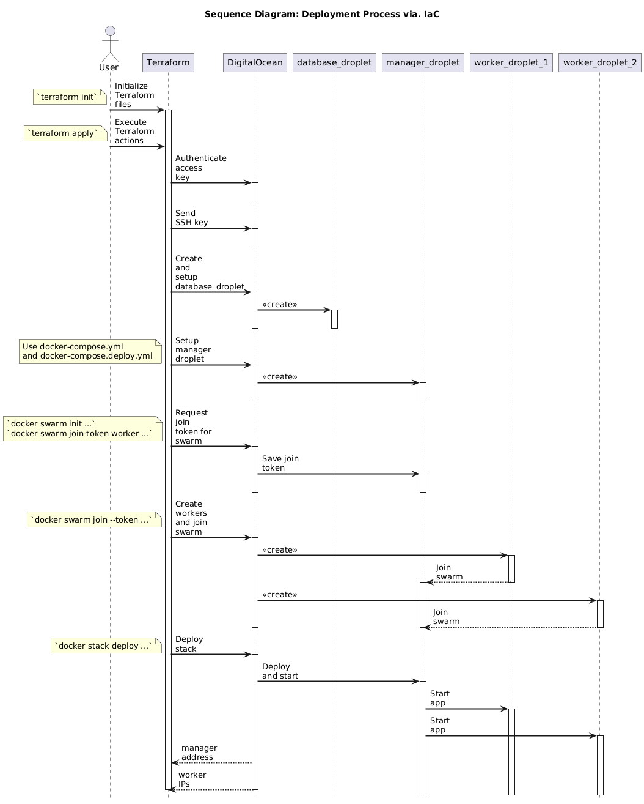

# System Perspective

## Minitwit

### Programming Language
[GoLang](https://go.dev/) (Go) was chosen based on documentation (**ref**), community support (**ref**), industry adoption [@stackoverflow_survey_2024], and the notion of being ’lightweight’ - both in terms of syntax and performance overhead. The group additionally wanted to prioritize a language they had limited experience with.

The programming languages [C#](https://dotnet.microsoft.com/en-us/languages/csharp), [Java](https://www.java.com/en/), [GoLang](https://go.dev/), and [Crystal](https://crystal-lang.org/) were considered.
[Java](https://www.java.com/en/) and [C#](https://dotnet.microsoft.com/en-us/languages/csharp) were discarded as candidates, as both were considered to be verbose object-oriented languages, and that the group had extensive previous experience within these languages.
This led to a comparison between [GoLang](https://go.dev/) and [Crystal](https://crystal-lang.org/), outlined in Table 2.
 
| **Topic / Lang**         | **GoLang**                               | **Crystal**                             |
|--------------------------|-------------------------------------------|------------------------------------------|
| **Team Competences**     | Some prior exposure in small capacities   | No prior experience                      |
| **Ecosystem & Libraries**| Well-supported, uses GitHub               | Uses GitHub, but less extensive          |
| **Industry Usage**       | Extensive adoption [@stackoverflow_survey_2024] | Limited adoption [@stackoverflow_survey_2024]|
| **Docker Compatibility** | Yes                                       | Yes                                      |
| **Performance**          | Fast                                      | Fast                                     |
| **Concurrency**          | Strong support                            | Good                                     |
| **Documentation**        | Well-documented                           | Good but less extensive                  |
| **Community**            | Large and active                          | Smaller and less active                  |

Table: Comparison between programming languages [GoLang](https://go.dev/) and [Crystal](https://crystal-lang.org/).

### External dependencies in GoLang
| **Dependency** | **Description** |
| --- | ------- |
| **labstack/echo/v4**          | Web framework for routing and HTTP handling.                                                       |
| **gorilla/sessions**          | Session management with secure cookie support.                                                     |
| **lib/pq**                    | PostgreSQL driver for database connectivity.                                                       |
| **golang.org/x/crypto**       | Cryptographic utilities for security features.                                                     |
| **prometheus/client\_golang** | Prometheus client for metrics and monitoring.                                                      |
| **shirou/gopsutil/v4**        | System metrics collection for health monitoring.                                                   |
| **klauspost/compress**        | Compression libraries to optimize data transfer.                                                   |
| **golang.org/x/sys**          | Low-level OS interaction and system calls.                                                         |
| **google.golang.org/protobuf**| Protocol Buffers support for data serialization.                                                   |
| **gorilla/securecookie**      | Secure cookie encoding/decoding for session safety.                                                |
| **Gravatar**                  | External web service providing avatar images generated from email hashes. |

Table: External dependencies for the Go implementation of MiniTwit. (see [`go.mod`](https://github.com/DuwuOps/minitwit/blob/6faf790cde505828b23b891698cd11fe85e31ad0/go.mod) for more details.)

### Design and Architecture 
This section presents the architecture of the system by exploring the [`src/`](https://github.com/DuwuOps/minitwit/tree/6faf790cde505828b23b891698cd11fe85e31ad0/src) directory. The architecture is explored through two views:

1. A module-level description of the MiniTwit implementation, depicted in a UML module diagram (**Figure X**), and table detailing each module with corresponding description (**Table X**).
2. Two UML sequence diagrams (**Figure x** and **Figure X**). Showcasing the process involved when user requests a "follow"-interaction through respectively the *UI* and the testing *API* (Note that these are separate endpoints).

{#fig:module-diagram width=80% placement=H}

| Module | Description |
|---|---------|
| **`datalayer`** | Responsible for database connection and initialization. Implements the data access layer through `repository.go` and its interface `irepository.go`. |
| **`models`** | Contains data models: `User`, `Message`, `Follower`, and `LatestAccessed`. |
| **`handlers`** | Central logic of the system. Orchestrates operations for each model. |
| **`handlers.repo_wrappers`** | Utility functions extending repository logic. |
| **`handlers.helpers`** | Shared logic. |
| **`routes`** | Maps HTTP endpoints to their corresponding handlers. |
| **`metrics`** | Registers custom Prometheus metrics to monitor system statistics. |
| **`middleware`** | Applies Cross-Site Request Forgery middleware. |
| **`snapshots`** | Handles creation of database snapshots for models. |
| **`template_rendering`** | Renders templates used by the frontend. |
| **`templates`** | Holds frontend HTML files. |
| **`utils`** | Contains shared utility methods used across the codebase. |

Table: Description of modules in GoLang MiniTwit implementation.

{#fig:sequence-diagram-follow-ui width=80% placement=H}

{#fig:sequence-diagram-follow-api width=80% placement=H}

### Current State of the System

The analysis tools of [SonarQube](https://www.sonarsource.com/products/sonarqube/) and [CodeClimate](https://codeclimate.com/) were utilized in order to gauge the complexity of the MiniTwit implementation (**Figure X** and **Figure X**). Both tools show that the `handlers` module has relatively high complexity, which may require focused attention for maintainability.

| Metric                 | Value                  |
|------------------------|------------------------|
| Lines of Code (LOC)    | 1,591                  |
| Code Duplication       | 4.1%                   |
| Security Hotspots      | 8                      |
| Overall Rating         | A (Excellent quality)  |
| Cyclomatic Complexity  | 216 (handlers: 151)    |
| Technical Debt         | ~1 hour 7 minutes      |

Table: Summarized quality metrics from SonarQube analysis.

| Metric                 | Value                  |
|------------------------|------------------------|
| Lines of Code (LOC)    | 1,912                  |
| Code Duplication       | 0%                     |
| Overall Rating         | A (Excellent quality)  |
| Complexity             | 299 (handlers: 196)    |
| Technical Debt         | ~1 day 2 hours         |

Table: Summarized quality metrics from CodeClimate analysis.

## Orchestration
To streamline deployment, Docker, Docker Compose, Docker Swarm, and Terraform were chosen. 

The Dockerfile builds a minitwit container image in two stages: 

1. Compiling the Go source code from the `src` package into a binary. 

2. Copying the compiled binary and necessary static files into a runtime image.

There are two docker-compose files, `docker-compose.yml` and `docker-compose.deploy.yml`. Both define the six core services of the system: `app`, `prometheus`, `alloy`, `loki`, `grafana`, and `database`. 

Except for the minitwit app and the database, the services use configuration specifications from corresponding `/.infrastructure/` sub-packages. 

{#fig:informal-context-diagram width=80% placement=H}

- `docker-compose.yml` is used for local deployment and image publishing. It uses `localhost` IP-adresses and includes default usernames and passwords. 

- `docker-compose.deploy.yml` is used for remote deployment. It builds on `docker-compose.yml` but overrides relevant configuration. 
It defines a Docker Swarm setup with one manager and two worker nodes. The `app` runs on two worker replicas, while logging and monitoring services are constrained to only run on the manager node (though `alloy` collects logs from all nodes). This setup enables horizontal scaling. 

Infrastructure as Code (IaC) is used yo simplify the remote setup of the Docker Swarm. Terraform files are located in `.infrastructure/infrastructure-as-code/`. Automatic deployment via. Terraform is illustrated in the sequence diagram below. 

{#fig:sequence-diagram-iac width=80% placement=H}

## Deployment

### VPS

To host the system on a remote server, [DigitalOcean](https://www.digitalocean.com/products/droplets) was chosen as the Virtual Private Server (VPS) provider. This choice was based on pricing (see @tbl:vps-comparison), its apparent ease-of-use[@Quinn_2022] [@aliamin7] [@Finder_2023], and its familiarity to the group.

| **VPS**                   | **DigitalOcean**                      |  **Microsoft Azure**          | **Oracle**                        | **AWS (Lightsail)**                   |
|---------------------------|---------------------------------------|-------------------------------|-----------------------------------|---------------------------------------|
| **Virtual Machine Price** | ca. $12/mo [@digitalocean_price]      | ca. $15/mo [@azure_price]     | $13/mo [@oracle_price]            | ca. $12/mo [@aws_lightsail_price]     |
| **Storage Price**         | 50GB included [@digitalocean_price]   | ca. $5 (64GB) [@azure_price]  | ca. $2.5 (50GB) [@oracle_price]   | ca. $12/mo [@aws_lightsail_price]  |
| **Total Price**           | ca. $12/mo                            | ca. $20/mo                    | ca. $15.5/mo                      | ca. $12/mo                            |

: Price comparison of VPS providers. {#tbl:vps-comparison}

### Infrastructure-as-Code

To ensure a consistent and automatic creation of the infrastructure of the system on DigitalOcean, Terraform was used. Terraform is an IaC tool[@Terraform_MainPage], which has an easy-to-use built-in provider for DigitalOcean[@Anicas_Hogan_2022]. 

### Allocation Viewpoint

{#fig:deployment-diagram width=80% placement=H}

## Database 

Our setup includes two PostgreSQL databases: one for production and one for testing. Each runs on a separate, containerized droplet, with access restricted via a firewall to ensure security and isolation between environments (see Figure 1).

[PostgreSQL](https://www.postgresql.org/) was chosen to replace the SQLite setup, due to strong SQL standards compliance [@do_dbcomparison], high community adoption [@stackoverflow_survey_2024], and advanced features (e.g., JSON, HStore, Security) [@tooljet_mariavspostgres], [@Medium_Peymaan_DB_Comparison].

### Choice of Technology - Database

We compared leading relational databases based on the Stack Overflow 2024 Developer Survey [@stackoverflow_survey_2024]. Only open-source, self-hosted Relational Database Management Systems (RDBMSs) were considered.

| **Database** | **SQLite** | **PostgreSQL** | **MySQL** | **Oracle** | **SQL Server** | **MariaDB** |
| --- | --- | --- | --- | --- | --- | --- |
| **Popularity** | 33.1% [@stackoverflow_survey_2024] | 49.7% [@stackoverflow_survey_2024] | 40.3% [@stackoverflow_survey_2024] | 10.1% [@stackoverflow_survey_2024] | 25.3% [@stackoverflow_survey_2024] | 17.2% [@stackoverflow_survey_2024] |
| **License** | Public-Domain [@sqlite_license] | Open-Source [@postgresql_license] | Open-Source & Proprietary [@MySQL_license] | Proprietary | Proprietary [@microsoftsqlserver_license] | Open-Source [@mariadb_license] |
| **Standards Compliance** [@SQL_Standard_ISO] | Low [@do_dbcomparison] | Compliant [@do_dbcomparison] | Limited [@do_dbcomparison] | *Unknown* | *Unknown* | Fork of MySQL; Assumed limited |
| **Max Connections** | 1 | 500,000+ [@Medium_Peymaan_DB_Comparison] | 100,000+ [@Medium_Peymaan_DB_Comparison] | *Unknown* | *Unknown* | 200,000+ [@Medium_Peymaan_DB_Comparison] |
| **Horizontal Scaling** | No | Yes [@Medium_Peymaan_DB_Comparison] | Yes [@Medium_Peymaan_DB_Comparison] | *Unknown* | *Unknown* | Yes [@Medium_Peymaan_DB_Comparison] |
| **Concurrency Handling** | None | Excellent [@Medium_Peymaan_DB_Comparison] | Moderate [@Medium_Peymaan_DB_Comparison] | *Unknown* | *Unknown* | Strong [@Medium_Peymaan_DB_Comparison] |

Table: Comparison of RDBMSs.
**Note**: Performance benchmarks are excluded due to license restrictions placed on benchmarking by licensing of proprietary DBMSs [@Oracle_Network_License].
 
MySQL was ruled out due to licensing issues and development concerns post-Oracle acquisition [@Fedora_MariaDB], [@do_dbcomparison].