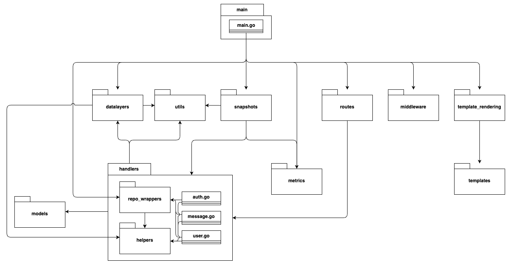

# System perspective

This section presents the system.

## Design and architecture 
The system is primarily built using Go (Golang) for backend development. The Echo web framework is used for HTTP routing and middleware management. PostgreSQL serves as the database. Additionally, the system uses various Go libraries for security, session management, data serialization, monitoring, system metrics, and external systems that will be presented later. 

This section presents the architecture of the system by exploring the `src` folder of the repository.

### Module diagram

An overview of the modules of the codebase in the `src` folder is presented by the following package diagram.    
Note that within the `handlers` folder, the classes `auth.go`, `message.go`, and `user.go` and their dependencies are highlighted, depicting the complexity of this central module. This is thereby not a normal package diagram.

In the diagram it can be seen, that the main.go file orchestrates the system. It (in this context) has the responsibility for:
1. Rendering the template (frontend)
2. Initializing a new instance of the database object
3. Setting up middleware
4. Setting up routes, which have the responsibility of exposing the endpoints that further orchestrates to the handlers module for the logic of the API.

### Sequence diagrams
Two sequence diagrams have been created to show the flow of information through the system, from a "Follow" request by a user, to the system's returned response. 

They contain the following high-level lifelines:
- User Interface: The minitwit web application
- API Handlers: All functions in the `handlers` package, which handle requests to the API endpoints.
- Datalayer: The `datalayer`package, which handles database interactions and returns structs (see the `model` package).
- Database: The postgres database.

The first version shows the processes involved when the request is sent via. the *UI*, whereas the second version shows the processes involved when sent via. the *API*. 

Note that the two versions use different endpoints to interact with the same API.

## Dependencies
| Dependency                               | Description                                                                                        |
| ---------------------------------------- | -------------------------------------------------------------------------------------------------- |
| **Go (Golang)**                          | Programming language for backend development.                                                 |
| **github.com/labstack/echo/v4**          | Web framework for routing and HTTP handling.                                                       |
| **github.com/gorilla/sessions**          | Session management with secure cookie support.                                                     |
| **github.com/lib/pq**                    | PostgreSQL driver for database connectivity.                                                       |
| **PostgreSQL**                           | Relational database storing                                                       |
| **golang.org/x/crypto**                  | Cryptographic utilities for security features.                                                     |
| **github.com/prometheus/client\_golang** | Prometheus client for metrics and monitoring.                                                      |
| **github.com/shirou/gopsutil/v4**        | System metrics collection for health monitoring.                                                   |
| **github.com/klauspost/compress**        | Compression libraries to optimize data transfer.                                                   |
| **golang.org/x/sys**                     | Low-level OS interaction and system calls.                                                         |
| **google.golang.org/protobuf**           | Protocol Buffers support for data serialization.                                                   |
| **github.com/gorilla/securecookie**      | Secure cookie encoding/decoding for session safety.                                                |
| **Gravatar**                             | External web service providing avatar images generated from email hashes (used for user profiles). |

## Current state of the system

### SonarQube analysis summary

The following table summarizes key code quality metrics from SonarQube analysis:

| Metric                 | Value                  |
|------------------------|------------------------|
| Lines of Code (LOC)    | 1,591                  |
| Code Duplication       | 4.1%                   |
| Security Hotspots      | 8                      |
| Overall Rating         | A (Excellent quality)  |
| Cyclomatic Complexity  | 216 (handlers: 151)    |
| Technical Debt         | ~1 hour 7 minutes      |

### Code Climate

The following table summarizes key code quality metrics from Code Climate analysis:

| Metric                 | Value                  |
|------------------------|------------------------|
| Lines of Code (LOC)    | 1,912                  |
| Code Duplication       | 0%                     |
| Overall Rating         | A (Excellent quality)  |
| Complexity             | 299 (handlers: 196)    |
| Technical Debt         | ~1 day 2 hours         |

### Overall assessment

Both tools show that the `handlers` module has relatively high complexity, which may require focused attention for maintainability.

## Orchestration
To streamline deployment, Docker, Docker Compose, Docker Swarm, and Terraform are used. 

The Dockerfile builds a minitwit container image in two stages: 
1. Compiling the Go source code from the `src` package into a binary. 
2. Copying the compiled binary and necessary static files into a runtime image.

There are two docker-compose files, `docker-compose.yml` and `docker-compose.deploy.yml`. Both define the six core services of the system: `app`, `prometheus`, `alloy`, `loki`, `grafana`, and `database`. 

`docker-compose.yml` is used for local deployment. It uses `localhost` IP-adresses and includes default usernames and passwords. 

`docker-compose.deploy.yml` is used for remote deployment. It builds on `docker-compose.yml` but overrides relevant configuration. 
It defines a Docker Swarm setup with one manager and two worker nodes. The `app` runs on two worker replicas, while logging and monitoring services are constrained to only run on the manager node (though `alloy` collects logs from all nodes). This setup enables horizontal scaling. 

Infrastructure as Code is used simplify the remote setup of the Docker Swarm. Terraform files are located in `.infrastructure/infrastructure-as-code`. Automatic deployment via. Terraform is illustrated in the sequence diagram below. 

## Deployment

### VPS

To host the system on a remote server, [DigitalOcean](https://www.digitalocean.com/products/droplets) was chosen as the VPS provider. This choice was based on pricing (see @tbl:vps-comparison), its apparent ease-of-use[@Quinn_2022] [@aliamin7] [@Finder_2023], its familiarity to the group.

| **VPS**                   | **DigitalOcean**                      |  **Microsoft Azure**          | **Oracle**                        | **AWS (Lightsail)**                   |
|---------------------------|---------------------------------------|-------------------------------|-----------------------------------|---------------------------------------|
| **Virtual Machine Price** | ca. $12/mo [@digitalocean_price]      | ca. $15/mo [@azure_price]     | $13/mo [@oracle_price]            | ca. $12/mo [@aws_lightsail_price]     |
| **Storage Price**         | 50GB included [@digitalocean_price]   | ca. $5 (64GB) [@azure_price]  | ca. $2.5 (50GB) [@oracle_price]   | ca. $12/mo [@aws_lightsail_price]  |
| **Total Price**           | ca. $12/mo                            | ca. $20/mo                    | ca. $15.5/mo                      | ca. $12/mo                            |

: Price comparison of VPS providers. {#tbl:vps-comparison}

### Infrastructure-as-Code

To ensure a consistent and automatic creation of the infrastructure of the system on DigitalOcean, Terraform was used. Terraform is an infrastructure as code tool[@Terraform_MainPage], which has an easy to use inbuilt provider for DigitalOcean[@Anicas_Hogan_2022]. Please see figure **ref** for an overview of how Terraform builds the infrastructure of the system on DigitalOcean.

### Allocation viewpoint

